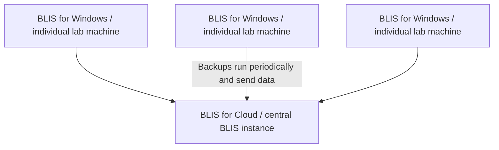
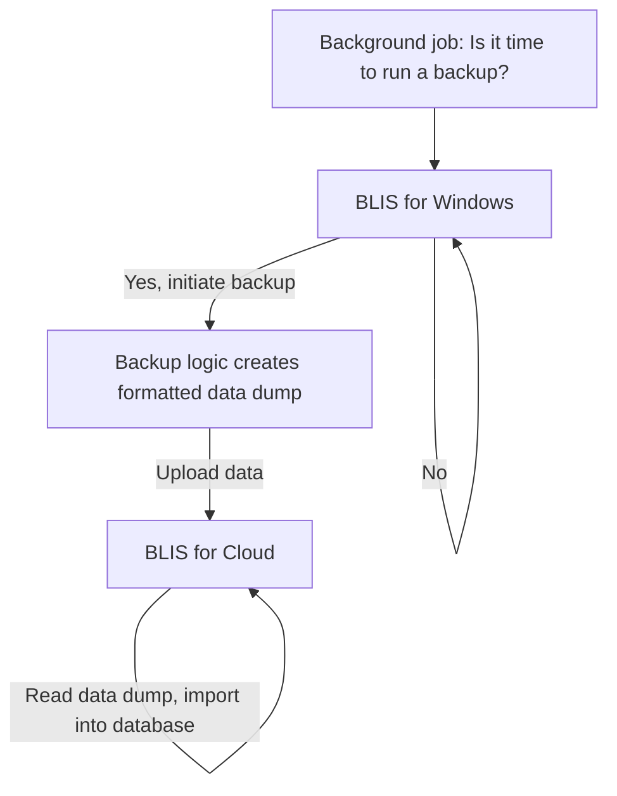

# Initial Evaluation

<iframe width="560" height="315" src="https://www.youtube.com/embed/SDEhfS0qGiI" title="YouTube video player" frameborder="0" allow="accelerometer; autoplay; clipboard-write; encrypted-media; gyroscope; picture-in-picture" allowfullscreen></iframe>

## Project Status (last updated 2022 March 02)

For the remainder of the semester, we are focusing on **creating a version of BLIS that can perform periodic updates to a version of BLIS running on a remote server.**

The architecture will look roughly like:

We are splitting up the work like this:

|Task|Assignee|
|-|-|
|Create UI for configuring backup server in BLIS for Windows|Rita|
|Create background job to initiate a data dump and send data to the central server|Kristy|
|Implement the logic and define the format for dumping the data|Mitchell|
|Create endpoint on BLIS for Cloud to receive and import a data dump|Victor|

## Partner Organization

Our partner organization is the group of labs using the C4G BLIS tool currently. C4G Basic Laboratory Information System (BLIS) is an open-source system to track patients, specimens, and laboratory results. We are working in collaboration with Dr. Vempala to coordinate communication with country level BLIS coordinators. Individual labs are using the local BLIS tool currently, but some regions have reliable internet and have made requests for an online version of the tool. We aim to work on the following specific needs:

* Provide a way to host BLIS in a persistent,
Internet-connected way that is “always on”
* Provide a way to see the data from many labs
at once
* Provide an updated FAQ to answer immediate
questions regarding BLIS’ operations

## Project Goals

### Main Goal

Currently, there is a Country Director mode of operation that allows a director to view the data of multiple labs at once by having those labs export a backup file and import it from the country director side. This could be streamlined by providing a con- figuration option from individual lab BLIS instances to send periodic backups to a central server which can be ingested and analyzed there.

### Side Goals

*Data Visualization:* Currently, in the country director view, we can see the aggregated data from each of the individual labs. This data can be presented to depict temporal changes of a disease progression or tests conducted across the various labs employing BLIS. We are considering various interactive and static visualization options. Aggregate data visualization will have limited access to only the country director view, as it is intended for policy decision making purposes.

*Updating FAQ:* The current set of frequently asked questions is quite limited. Our stretch goal here is to expand the information covered and move the FAQs to a seperate page.

*Updating PHP verions:* The version of PHP that BLIS uses is quite outdated. We propose updating BLIS to use a more recent PHP version in preparation for a future version of BLIS that can be containerized and deployed to the cloud.

## Feedback and Development

We are awaiting a chance to get input from the stakeholders on their preference, but we will propose some combination of the following options for the feedback loop:

* Milestone check-ins
* Demo sessions via live meetings
* Sync via email channel

We also outline a plan for development, evaluation, and deployment.

* *Development:* we’ll develop new features utilizing version control with a forked version of the repository.
* *Evaluation:* we’ll ask end users a few quantitative questions (how often they would use each new feature, on a scale of 1-5; how easy to
use it was, etc.), as well as solicit qualitative feedback (is there anything they would change to make the new feature easier to use).
* *Deployment:* after new features are ready for deployment, we’ll submit pull requests to the main BLIS repository. We can provide a BLIS
update package for clients to use, if necessary.

Finally, we note an important consideration that affected design choices. Since backwards compatibility is a key feature of BLIS, developing a hybrid server/desktop version is probably not feasible. Given that, we can add a feature to the current version of BLIS that can export and periodically upload data to a central node, which can be designed as a full server-side/cloud application.
