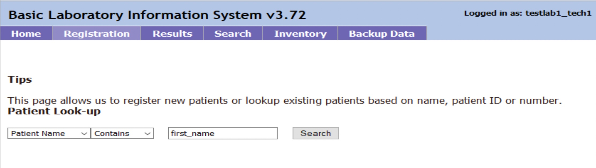
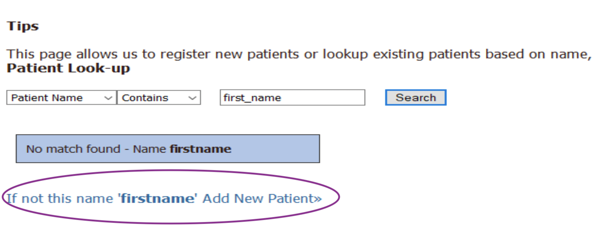

# Frequently Asked Questions

### Q: I am trying out BLIS. How do I login?
<b>A</b>: Please login using the credentials: testlab1_admin/admin123 (as admin) or testlab1_tech1, testlab1_tech2/tech123 (as lab technician).

### Q: How do I add a new patient?
<b>A</b>: To add a new patient, navigate to the Registration tab. Search for the patient by name, number, or ID. 

After you search for the patient, you will see an option to add new patient. Click the link to proceed. 

