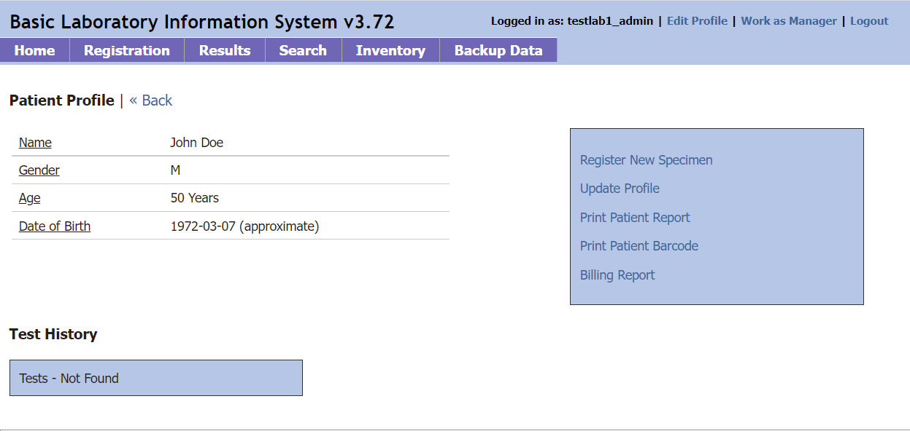

# Frequently Asked Questions

### Q: I am trying out BLIS. How do I login?
<b>A</b>: Please login using the credentials: testlab1_admin/admin123 (as admin) or testlab1_tech1, testlab1_tech2/tech123 (as lab technician).

### Q: How do I look up a patient in our system?
<b>A</b>: Navigate to the Registration tab and search for the patient by name, number, or ID.

### Q: How do I add a new patient?
<b>A</b>: To add a new patient, navigate to the Registration tab. Do not enter anything into the search bar and click 'Search'. You will see an option to add new patient appear. Click the link to proceed. 

### Q: How do I add a new Specimen to a patient?
<b>A</b>: After pulling open the patient's profile, click the 'Register New Specimen' hyperlink on the righthand side. 

### Q: How do I configure BLIS to upload data to the central web instance [Manager View Only]?
<b>A</b>: In the Manager view, naviate to the Lab Configuration Tab, and then BLIS Online. Enter in the IP address of the BLIS server.

