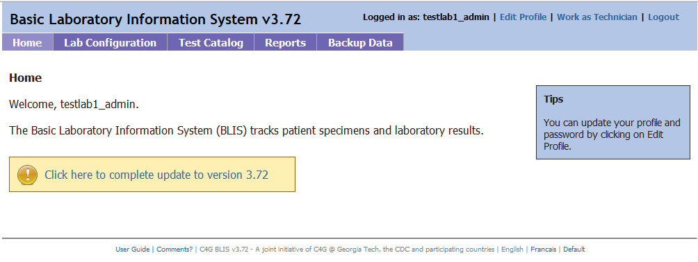
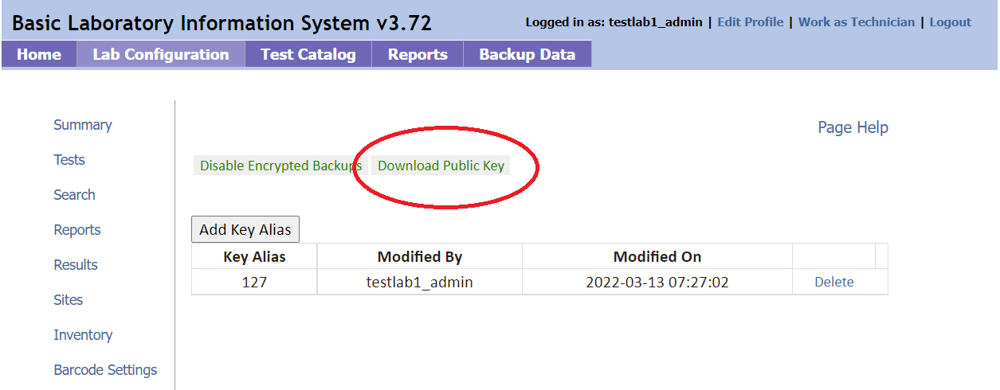
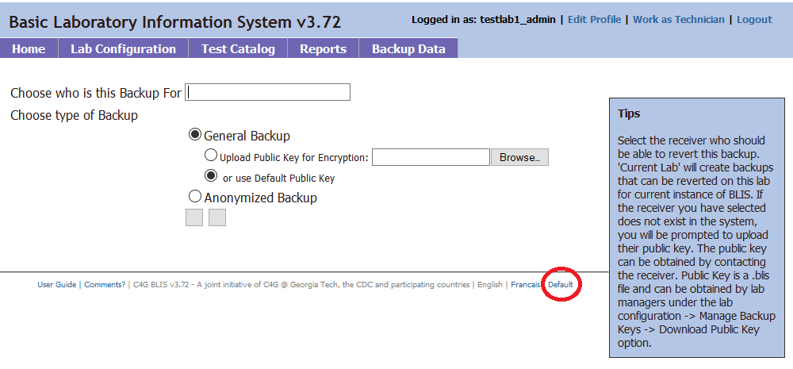

# Peer Evaluations

Welcome to the C4G BLIS Webpage! Thanks for taking the time to review our project.

Our main objective this semester was to create a create a version of BLIS that can push data from local computers running BLIS on Windows to a version of BLIS running on a remote server. You can read more about our objectives and current Project Status by checking out [the Home page!](https://c4g-spr22-blis.github.io)

## Peer Review Task #1: Testing BLIS Cloud

Over the past semester, we've been working to deploy a version of BLIS that is capable of running on a Cloud Provider. It is accessible with the following link:

[http://188.166.124.131/home.php](http://188.166.124.131/home.php) 

For the first part of our peer review task, please open the short form, accessible here:

[https://forms.office.com/r/YG4cMaC0rP](https://forms.office.com/r/YG4cMaC0rP)

Instructions for this peer review task is embedded in the form. The first part of the peer review task ends after Task F; please do not close the survey and follow the instructions to complete the second half of the peer review evaluations.

## Peer Review Task #2: Pushing a data backup to BLIS Cloud

Testimonies and user feedback from labs in Africa indicate that internet availability is not always guarenteed, so we wanted to create a version of BLIS for Windows that could push data to BLIS Cloud (or a central BLIS instance) when the user initiates the action. This next peer review task involves installing C4G BLIS v3.72, the most current version of BLIS.

!!! warning

    BLIS is a Windows-based program and is most reliably accesible through the Microsoft Windows Operating System. 

### Instructions
1. [Navigate to our instructions to install BLIS on Windows](https://c4g-spr22-blis.github.io/developer_documentation/blis_on_windows/) and follow the instructions to install BLIS on Windows. If you have any difficulties running BLIS, feel free to check out the FAQ or reach out to the dev team.

2. After running `BLIS.exe`, you should be able to log into BLIS using the bundled Firefox web browser. You can use the same credentials to log in as last time, testlab1_admin/admin123 for the username/password combination.

!!! info "Note"
    After logging in, if you are prompted to update BLIS to version 3.72, please do so!

    

Our next set of instructions will step you through the process of a BLIS lab manager connecting to the BLIS Cloud server and creating a key.

3. Click on the **Lab Configuration** tab, and then **Blis Online** on the left-hand side (you may need to scroll down to see the option; if the UI is blank, please read the FAQ Question "What's going on with the UI?").

4. Please enter in the BLIS Cloud ip address **188.166.124.131** and click **Save**. We have not yet built in UI functionality to confirm the save, FYI.

    

5. Click on the **Manage Backup Keys** tab on the lefthand side. Next, click on **Download Public Key** button in green to download the public key for encryption purposes.

    

6. After downloading the public key, click on the **Add Key Alias** button on the same page. You can put any name in the key alias, but for the purposes of this exercise, we will use "my_pubkey" as an example. Please upload the previously downloaded public key, and click **Add** to finish. A textbox prompt will say, "Key added successfully" upon a successful completion.

    

7. Next, navigate to the **Backup Data** tab at the top selection bar. We are still working on the UI for the various languages that C4G BLIS supports, so please click *Default* at the bottom of the screen. This issue will be fixed in our final iteration.

    

8. Next, please input the name you used previously for the key alias, "my_pubkey". Please select **General Backup** and **Upload Public Key for Encryption**. Then, click **Browse** and upload the key that you previously saved to your Downloads.

9. (Optional) Click **Download local .ZIP backup**. It will send you to a new window prompting you to download a zip folder and save it to your disk. For the purposes of this peer evaluation, you do not need to download the zipped folder to your disk. You will see the following image if done correctly:

    

10. Click **Send data backup to server** to send the data backup to the BLIS Cloud. A new window will pop-up and inform you that the data has been pushed to the server successfully.

11.  Finally, please finish the last survey question (Task G) and submit the survey on Google Forms. Thank you for providing your feedback!